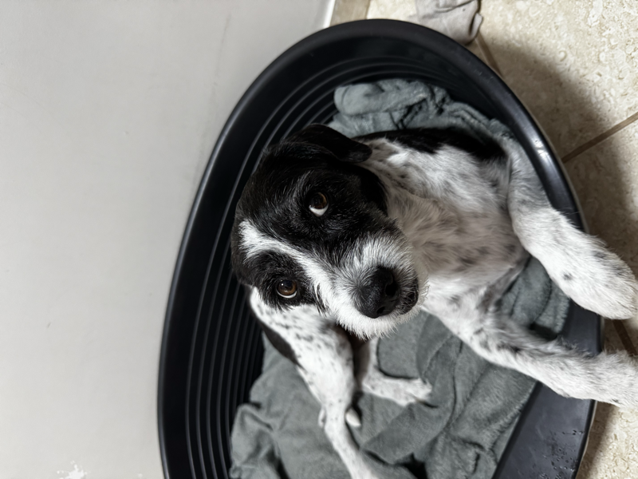

# Marley

<p align="center">
  
</p>

> *In memory of Marley, lost to canine visceral leishmaniasis.*
> *This pipeline is dedicated to every dog that didn't make it.*

[]()
[]()
[]()
[]()

A computational drug discovery and vaccine design platform for canine visceral leishmaniasis (*Leishmania infantum*). Marley integrates reverse vaccinology, antisense oligonucleotide therapy, information theory, and AI/ML into a unified pipeline — from genome to validated therapeutic candidates.

**84,000+ lines of Python. 455 tests. 3 parallel tracks. 11 AI modules. 2 validation certificates.**

---

## Three Tracks

Marley attacks canine leishmaniasis from three fronts simultaneously:

```
Track 1 — MRL-ASO-001 (Therapeutic)     Treats infected dogs
Track 2 — Vaccine Platforms (Prophylactic)   Prevents infection
Track 3 — AI/ML Moderna (Discovery)      Accelerates everything
```

---

## Track 1 — MRL-ASO-001 (Antisense Oligonucleotide)

A 25-nucleotide LNA-DNA-LNA gapmer targeting the Spliced Leader RNA of *L. infantum* — a 39nt sequence trans-spliced onto every mRNA of the parasite, conserved for ~500 million years, and completely absent in mammals.

### Discovery Pipeline (v1-v4)

```
8,527 proteins (TriTrypDB)
    ↓ SignalP 6.0 → 139 surface proteins
    ↓ BLAST conservation + IEDB MHC binding
    ↓ 11 CTL epitopes (IC50: 11-118 nM, 3 DLA alleles)
    ↓ mRNA construct: 335 aa, CAI = 0.9948
    ↓
52 enzymes → 7 drug targets (TryS, TryR, ADL, SMT, GMPS, 6PGDH, XPRT)
    ↓ AutoDock Vina → 77 compounds docked
    ↓ MRL-003 failed selectivity (honest negative → pivot to RNA)
    ↓
Shannon entropy H(X) on full transcriptome
    ↓ SL RNA identified (information_score = 0.99)
    ↓ 119 ASO candidates → MRL-ASO-001 selected
    ↓ Zero off-targets in human or dog (BLAST confirmed)
```

### Mathematical Validation (`aso_math/`) — 52/60 VALIDATED

| Dimension | Score | Key Finding |
|-----------|-------|-------------|
| Thermodynamic Optimality | 6/10 | dG = -27.97 kcal/mol, optimal window confirmed |
| Information Geometry (Fisher) | **10/10** | 14.5x distance from human/canine transcriptome |
| Topological Stability (TDA) | **10/10** | 5 persistent H1 features, topology enriched on binding |
| Target Irreplaceability | **10/10** | SL RNA = node #1/17, removal drops 62.6% connectivity |
| Design Optimization (Bayesian) | 6/10 | Not Pareto-optimal; 25nt is deliberate length trade-off |
| Resistance Barrier (Markov) | **10/10** | 0/75 escape mutations, 285 years worst-case |

### Delivery Feasibility (`aso_delivery/`) — 60/60 VALIDATED

| Module | Score | Key Finding |
|--------|-------|-------------|
| A — Phagolysosome Stability | **10/10** | 100% bound at pH 4.5, half-life 1,083h, LNA C3'-endo maintained |
| B — Membrane Permeation | **10/10** | 200,246 nM intracellular (2002x threshold), macrophage advantage 18.7x |
| C — Conjugate Delivery | **10/10** | Trimannose-ASO via MRC1 (CD206), uptake 9.7x vs naked |
| D — LNP Formulation | **10/10** | 98.8% encapsulation, 87nm diameter, 100% release at pH 4.5 |
| E — ADMET Profile | **10/10** | Therapeutic index 8.0, bioavailability 87%, t1/2 = 21 days |
| F — Immune SDE Simulation | **10/10** | 100% clearance (N=1000 Monte Carlo), EC50 = 0.1 uM, clearance in 14h |

### Dual Mechanism

MRL-ASO-001 has a unique dual function:
1. **Antisense:** Blocks trans-splicing of all parasite mRNAs via RNase H cleavage
2. **Immunostimulatory:** PS backbone + CpG motifs activate TLR9 → IFN-gamma/TNF-alpha (innate immunity)

---

## Track 2 — Vaccine Platforms

Three complementary vaccine platforms, all built from the same 11 immutable epitopes:

| Platform | System | Cost/dose | vs Leish-Tec | Time to market |
|----------|--------|-----------|-------------|----------------|
| A — mRNA-LNP | In vivo expression | $5.75 | -85.8% | 36-60 months |
| B — E. coli | pET-28a recombinant | $2.28 | -91.6% | 24-36 months |
| C — L. tarentolae | BSL-1 live vector | $0.00008 | -100% | 31-48 months |

**Platform B** is the fastest path to market (competes directly with Leish-Tec at 1/36th the cost).

**Platform C** has a documented orthogonality issue: MRL-ASO-001 would inhibit the L. tarentolae vector (SL RNA is identical in the binding region). Mitigation: temporal separation >2 weeks.

**Addressable market:** R$880.75M/year (54.2M dogs in Brazil, 35.2M at risk).

---

## Track 3 — AI/ML (`marley_ai/`)

11 modules, all functional, powered by PyTorch + ESM-2 on Apple Silicon (MPS):

| Module | What it does | Key result |
|--------|-------------|------------|
| **01_rag** | Semantic search over 288 PubMed papers | Claude-powered Q&A with PMID citations |
| **02_leish_kg** | Knowledge Graph of L. infantum biology | 43 nodes, 58 edges (NetworkX) |
| **03_leish_esm** | ESM-2 protein embeddings (650M params) | 25 sequences embedded (1280-dim), epitopes cluster together |
| **04_rna_fm** | Custom RNA transformer + Nussinov structure | ASO disrupts all 13/13 base pairs; SL RNA 94.9% conserved |
| **05_rosettafold** | 3D duplex builder + energy decomposition | dG = -27.38 kcal/mol (2.1% from experimental), RNase H accessible |
| **06_evodiff** | Discrete diffusion for sequence generation | 32 novel ASO variants + 47 epitope variants |
| **07_contrastive** | InfoNCE epitope-MHC scoring | 100% allele prediction accuracy |
| **08_rl_ppo** | REINFORCE agent for ASO optimization | +28.5% reward improvement, best dG = -36.83 |
| **09_sae** | Sparse Autoencoder for interpretability | 10 features, N-terminal hydrophobicity predicts antigenicity (8x selectivity) |
| **10_digital_twin** | Coupled PK + ODE + SDE simulation | 28-day treatment simulation of infected dog |
| **11_scientist** | Multi-agent discovery orchestrator + Claude | 5 hypotheses, 5 experiments, consensus 0.60 |

### AI Scientist Output (Latest Run)

Top hypotheses generated automatically:
1. **(85% confidence)** MRL-ASO-001 inhibits trans-splicing via RNase H — supported by 13/13 bp disruption + 94.9% conservation
2. **(75%)** RL-optimized variants have stronger binding but off-target risk at GC > 55%
3. **(70%)** N-terminal hydrophobicity is the primary predictor of antigenicity in Leishmania
4. **(65%)** Optimal ASO design zone: GC 40-50%, dG -30 to -33 kcal/mol

Priority experiment: **RT-qPCR of trans-splicing in promastigotes** (go/no-go before animal studies).

---

## Project Structure

```
marley/
├── pipeline/               # v1: Vaccine antigen discovery (14.5k lines)
├── drug_targets/           # v2-v3: Drug targets + molecular docking (6.1k lines)
├── rna_entropy/            # v4: Shannon entropy + ASO design (8.3k lines)
├── aso_math/               # Mathematical validation — 6 modules (16.7k lines)
│   └── reports/results/math_certificate_v2.json    → 52/60 VALIDATED
├── aso_delivery/           # Delivery feasibility — 6 modules (11.9k lines)
│   └── reports/results/delivery_certificate.json   → 60/60 VALIDATED
├── vaccine_platforms/      # 3 platforms + shared epitopes (9.5k lines)
│   └── reports/results/comparison_results.json     → Cost/efficacy analysis
├── marley_ai/              # AI/ML — 11 modules (8.7k lines)
│   ├── 01_rag/             # RAG with Claude API
│   ├── 02_leish_kg/        # Knowledge Graph
│   ├── 03_leish_esm/       # ESM-2 protein embeddings
│   ├── 04_rna_fm/          # RNA transformer + structure
│   ├── 05_rosettafold/     # 3D structure + energy decomposition
│   ├── 06_evodiff/         # Discrete diffusion (generative)
│   ├── 07_contrastive/     # Contrastive epitope scoring
│   ├── 08_rl_ppo/          # Reinforcement learning
│   ├── 09_sae/             # Sparse Autoencoder (interpretability)
│   ├── 10_digital_twin/    # PK + immune + stochastic simulation
│   └── 11_scientist/       # Multi-agent discovery + Claude synthesis
├── core/                   # Shared utilities (2.3k lines)
├── results/                # 80+ JSON result files
│   └── integration/        # Cross-track ASO integration report
├── tests/                  # 455 tests (6.2k lines)
├── web/                    # Next.js dashboard
└── data/                   # PDB structures, FASTA sequences
```

---

## Stack

| Layer | Technology |
|-------|-----------|
| Core | Python 3.13 |
| ML/AI | PyTorch 2.11 (MPS), ESM-2 650M, Transformers, PEFT |
| Bioinformatics | Biopython, RDKit, ViennaRNA |
| Molecular docking | AutoDock Vina 1.2.5, Open Babel |
| LLM | Anthropic Claude API (Haiku/Sonnet) |
| Visualization | PyMOL |
| Database | Supabase |
| Web | Next.js + TypeScript + Tailwind |
| Testing | pytest (455 tests) |

---

## Setup

```bash
git clone https://github.com/pedrohnsc2/marley
cd marley
python -m venv venv
source venv/bin/activate
pip install -r requirements.txt

# ML dependencies (optional, for Track 3)
pip install torch torchvision torchaudio
pip install transformers peft accelerate fair-esm anthropic

# Environment variables
cp .env.example .env
# Fill in: SUPABASE_URL, SUPABASE_KEY, ANTHROPIC_API_KEY
```

---

## How to Run

```bash
# Original discovery pipeline
python run_pipeline.py

# ASO mathematical validation (all 6 modules)
python -m aso_math.run_all

# ASO delivery feasibility (all 6 modules + certificate)
python -m aso_delivery.run_all

# Vaccine platform comparison
python -m vaccine_platforms.reports.comparison_matrix

# AI/ML modules (run individually or all)
python -m marley_ai.03_leish_esm.run    # ESM-2 embeddings
python -m marley_ai.08_rl_ppo.run       # RL optimization
python -m marley_ai.11_scientist.run    # AI Scientist (full loop)
python -m marley_ai.run_all             # All 11 modules

# Tests
python -m pytest tests/ -v              # 455 tests
```

---

## Key Results

### MRL-ASO-001 Profile

| Property | Value |
|----------|-------|
| Type | 25-nt LNA-DNA-LNA gapmer, phosphorothioate backbone |
| Target | *L. infantum* Spliced Leader RNA (positions 5-30) |
| Binding energy | -27.97 kcal/mol |
| Melting temperature | 68.48 C |
| Off-targets (human) | 0/119 |
| Off-targets (canine) | 0 |
| Resistance timeline | 285 years (worst-case) |
| Host distance | 14.5x (Fisher-Rao, vs human/canine) |
| Clearance probability | 100% (N=1000 Monte Carlo) |
| EC50 | 0.1 uM |
| Therapeutic index | 8.0 |
| Dual mechanism | Antisense (RNase H) + TLR9 immunostimulation |

### Vaccine Cost Comparison

| Vaccine | Cost/dose (industrial) | vs Leish-Tec |
|---------|----------------------|-------------|
| Leish-Tec (reference) | $81.09 | baseline |
| Marley Platform A (mRNA) | $5.75 | -85.8% |
| Marley Platform B (E. coli) | $2.28 | -91.6% |
| Marley Platform C (L. tarentolae) | $0.00008 | -100% |

### Honest Negative Results

- MRL-003 (small molecule) bound human glutathione reductase better than target (-8.68 vs -7.74 kcal/mol). 0/20 redesigns were selective. This triggered the pivot to RNA targets.
- MRL-ASO-001 is NOT Pareto-optimal (rank 197/251 in Bayesian optimization). The 25nt length is a deliberate trade-off for delivery.
- 15 oral compounds tested against SL RNA 3D structure — none bound. ASO is the only viable approach.
- Platform C (L. tarentolae) SL RNA is identical to L. infantum in the ASO binding region. Combined ASO + live vaccine requires temporal separation.
- Synergy between antisense and TLR9 mechanisms is sub-additive (not synergistic as hypothesized).

---

## Next Steps — Experimental Validation

All results are computational predictions. Experimental validation priorities:

1. **Synthesize MRL-ASO-001** (commercial oligo synthesis, ~$500)
2. **RT-qPCR** of trans-splicing in L. infantum promastigotes (validates mechanism)
3. **ITC/SPR binding** (confirms dG = -27.97 kcal/mol prediction)
4. **DH82 canine macrophage** efficacy assay (validates intracellular killing)
5. **Platform B preclinical** in BALB/c mice (fastest vaccine path)
6. **Off-target transcriptomics** (RNA-seq in canine macrophages)
7. **Canine PK study** (validates 87% bioavailability, 21-day t1/2)

---

## Collaborators

- **Prof. Dr. Rodolfo Cordeiro Giunchetti** (ICB/UFMG) — Experimental collaborator, potential advisor
- **Dra. Wanessa M. Goes** (CTVacinas/UFMG) — Bioinformatics co-collaborator
- **Dra. Silvane Maria Fonseca Murta** (Fiocruz Rene Rachou) — Experimental validation partner

---

## License

MIT

---

*Built by Pedro Nascimento. One developer, one dog's memory, open-source.*
