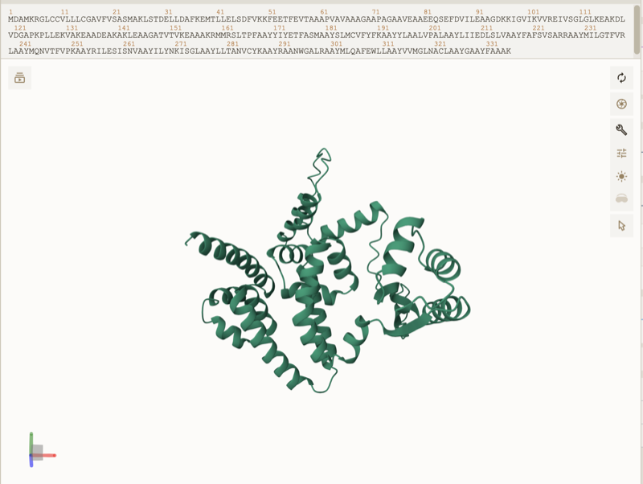
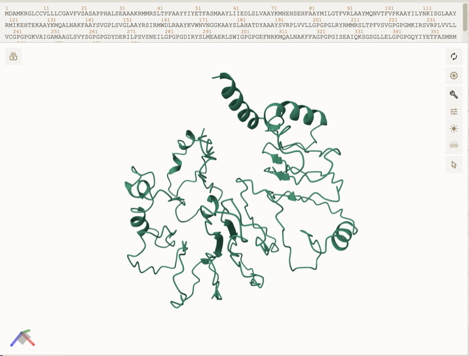
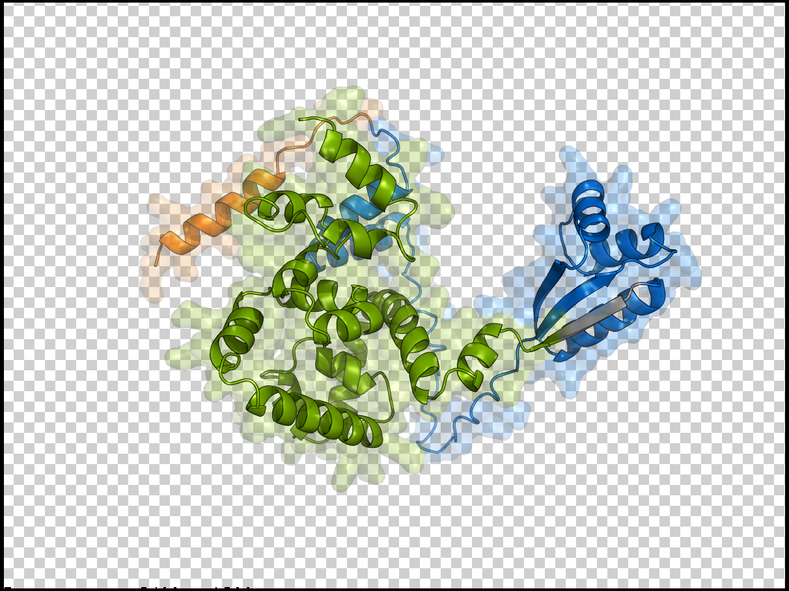
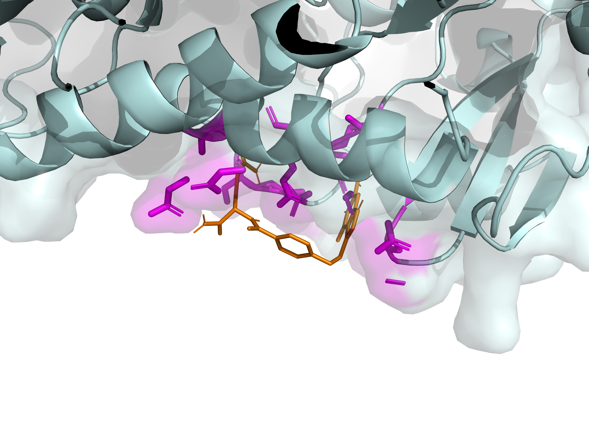
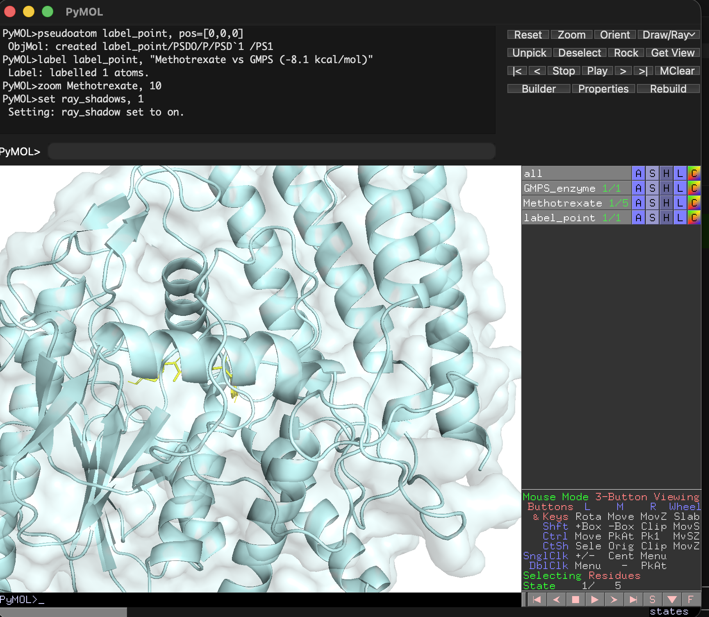
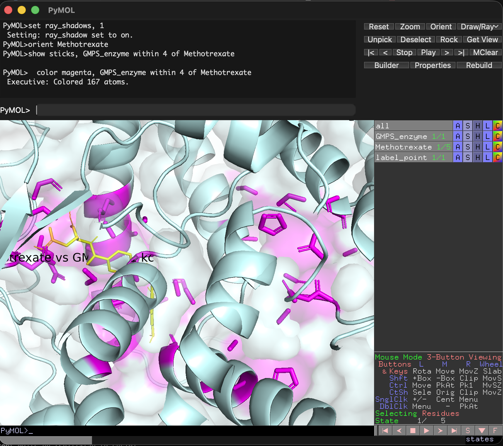
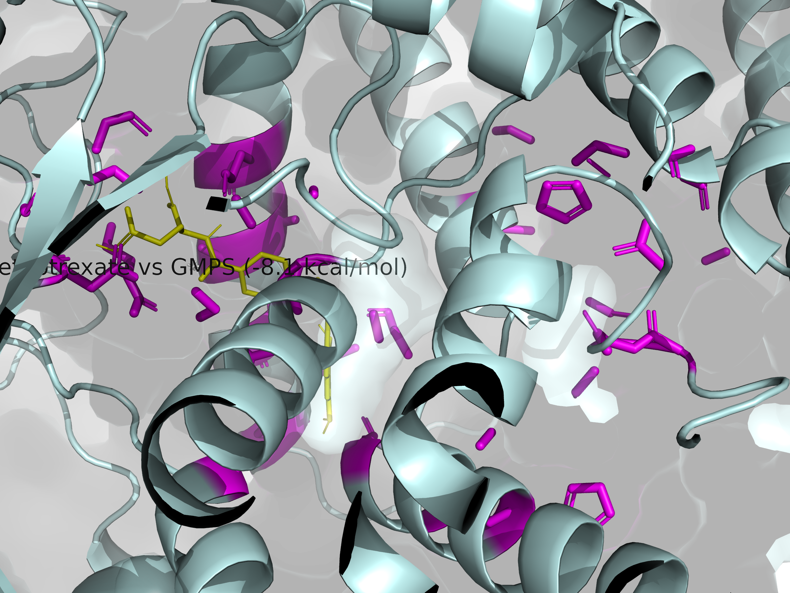

# Marley 🐾

<p align="center">
  
</p>

> *In memory of Marley, lost to canine visceral leishmaniasis.*
> *This pipeline is dedicated to every dog that didn't make it.*

[]()
[]()
[]()

An open-source bioinformatics pipeline for canine visceral leishmaniasis (*Leishmania infantum*). Marley automates vaccine antigen discovery, drug target identification, and molecular docking — from genome to candidate inhibitor molecules, fully computational.

---

## What it does

Marley attacks canine leishmaniasis from two fronts:

- **v1 (Vaccine)** — Identifies mRNA vaccine antigen candidates by filtering the *L. infantum* proteome through surface exposure, conservation, and immunogenicity predictions
- **v2 (Drug Targets)** — Maps 52 enzymatic drug targets across 5 metabolic pathways, ranked by structural divergence from human homologs
- **v3 (Molecular Docking)** — Screens approved drugs against top enzyme targets using AutoDock Vina, identifying candidate inhibitor molecules with 3D binding pose visualization
- **v4-RNA (Information Theory)** — Applies Shannon entropy to the *L. infantum* transcriptome, identifying RNA regions that are mathematically conserved in the parasite and absent in humans

---

## Pipeline stages

### v1 — Vaccine antigen discovery
```
TriTrypDB (L. infantum genome)
        ↓
01_fetch_genome       — Downloads all annotated protein sequences (~8,500)
        ↓
02_filter_surface     — Filters surface-exposed proteins via SignalP 6.0
        ↓
03_conservation       — Scores conservation across Brazilian strains via BLAST
        ↓
04_immunogenicity     — Predicts canine MHC binding via IEDB + loads pre-validated antigens
        ↓
05_report             — Generates ranked candidate list + Markdown report
        ↓
06_construct          — Designs multi-epitope mRNA vaccine construct
        ↓
07_structure          — 3D structure prediction via ESMFold + PyMOL/ChimeraX
```

### v2 — Drug target discovery
```
UniProt (L. infantum enzymes)
        ↓
01_fetch_enzymes      — Downloads 52 enzymes across 5 metabolic pathways
        ↓
02_human_comparison   — BLAST against human proteome, identity scoring
        ↓
03_essentiality       — DEG database + knockout literature validation
        ↓
04_druggability       — Composite score + AlphaFold 3D links
        ↓
05_report             — Ranked targets + Markdown report
```

### v3 — Molecular docking
```
v2 top targets + AlphaFold structures
        ↓
06_fetch_structures   — AlphaFold PDB download + PDBQT conversion
        ↓
07_compound_library   — ChEMBL + 12 curated antileishmanial drugs
        ↓
08_docking            — AutoDock Vina (parallel, 50 simulations)
        ↓
09_admet_filter       — Lipinski Rule of 5 (RDKit) + ADMET scoring
        ↓
10_docking_report     — Top hits + PyMOL 3D visualization
```

### v4-RNA — Information theory analysis
```
Transcriptome (UniProt + Ensembl)
        ↓
01_fetch_transcriptome — L. infantum + human mRNA sequences
        ↓
02_codon_usage         — RSCU calculation, codon bias scoring
        ↓
03_shannon_entropy     — Per-position entropy H(X) = -Σp(x)log₂p(x)
        ↓
04_sl_rna_analysis     — Spliced Leader mapping (39nt, conserved ~500M years)
        ↓
05_human_comparison    — Filter by entropy delta (parasite vs human)
        ↓
06_structure_prediction — RNA secondary structure (MFE via RNAfold)
        ↓
07_report              — information_score ranking + Markdown report
```

---

## Experimentally validated antigens

The following antigens are pre-loaded with priority status, sourced from published research by Brazilian groups (UFMG, UFOP, Fiocruz/MG):

| Antigen | Source | Evidence | Score |
|---|---|---|---|
| LiHyp1 | Giunchetti/UFMG | Murine validation, Th1 response via IFN-γ, immunoproteomics | 0.95 |
| A2 | UFMG / Leish-Tec | Only MAPA-approved vaccine in Brazil, 96.41% efficacy | 0.92 |
| LBSap_antigens | Reis/UFOP + Giunchetti/UFMG | Technology transferred to Ouro Fino Saúde Animal | 0.90 |
| Lutzomyia_longipalpis_proteins | Giunchetti/UFMG | Patent052, transmission-blocking | 0.88 |
| KMP-11 | Literature | High conservation across strains, documented immunogenicity | 0.85 |
| LiESP_Q | Literature | High diagnostic specificity, immunoprotective potential | 0.83 |
| LACK | Literature | T-cell activation in murine models | 0.82 |
| HSP70_HSP83 | Literature | Overexpressed under stress, conserved, strong cellular response | 0.80 |

---

## Stack

| Layer | Technology |
|---|---|
| Core language | Python 3.11+ |
| Bioinformatics | Biopython, RDKit |
| Molecular docking | AutoDock Vina 1.2.5 |
| Structure prep | Meeko, Open Babel |
| Visualization | PyMOL |
| Data | pandas |
| Database | Supabase |
| Web dashboard | Next.js + TypeScript |
| CI/CD | GitHub Actions |
| Signal peptide | SignalP 6.0 via BioLib SDK |
| External APIs | UniProt, NCBI BLAST, IEDB, AlphaFold, ChEMBL |

---

## Setup

```bash
git clone https://github.com/pedrohnsc2/marley
cd marley
pip install -r requirements.txt
cp .env.example .env
# Fill in SUPABASE_URL and SUPABASE_KEY
```

Run the Supabase schema:
```sql
create table candidates (
  id uuid default gen_random_uuid() primary key,
  gene_id text unique not null,
  gene_name text,
  sequence text,
  has_signal_peptide boolean default false,
  conservation_score float,
  immunogenicity_score float,
  final_score float,
  filters_passed text[],
  status text default 'pending',
  priority boolean default false,
  source text,
  evidence text,
  created_at timestamp default now(),
  updated_at timestamp default now()
);

create index idx_candidates_final_score on candidates(final_score desc);
create index idx_candidates_priority on candidates(priority desc);
```

---

## How to run

```bash
# Full pipeline (interactive, confirms each stage)
python run_pipeline.py

# Full pipeline (automated, saves progress between stages)
python run_full_pipeline.py

# Skip genome download if already fetched
python run_pipeline.py --skip-fetch

# Dry run (no external API calls)
python run_pipeline.py --dry-run

# Run tests
python -m pytest tests/ -v
```

### Web dashboard

```bash
cd web
npm install
cp .env.local.example .env.local
# Fill in Supabase credentials
npm run dev
# Open http://localhost:3000
```

---

## Module status

| Module | Status | Notes |
|---|---|---|
| 01_fetch_genome | ✅ Complete | 8,527 proteins downloaded from TriTrypDB |
| 02_filter_surface | ✅ Complete | SignalP 6.0 via BioLib SDK, 139 surface proteins identified |
| 03_conservation | ✅ Complete | NCBI BLAST against L. donovani, L. major, L. braziliensis |
| 04_immunogenicity | ✅ Complete | IEDB MHC-I (3 DLA alleles) + MHC-II (HLA-DRB1 proxy) |
| 04a_fetch_sequences | ✅ Complete | UniProt integration for validated antigen sequences |
| 05_report | ✅ Complete | Ranked CSV + Markdown report with validated antigens |
| 06_construct | ✅ Complete | Multi-epitope mRNA vaccine construct (CTL + HTL) |
| 06_variants | ✅ Complete | 3 construct variants (A/B/C) with comparison report |
| 07_structure | ✅ Complete | 3D structure prediction via ESMFold + PyMOL/ChimeraX |
| Web dashboard | ✅ MVP | Next.js + Tailwind, live data from Supabase |
| CI/CD | ✅ Complete | GitHub Actions: lint (ruff) + pytest on Python 3.11/3.12/3.13 |
| Test suite | ✅ 88 tests | Full coverage: pipeline, models, APIs, construct, structure |
| **v2: Drug Targets** | | |
| dt/01_fetch_enzymes | ✅ Complete | TriTrypDB enzyme fetch by EC number / metabolic pathway |
| dt/02_human_comparison | ✅ Complete | NCBI BLAST vs human proteome + UniProt active site diff |
| dt/03_essentiality | ✅ Complete | DEG + TriTrypDB knockout + curated literature |
| dt/04_druggability | ✅ Complete | Composite score + AlphaFold links + 7 priority targets |
| dt/05_report | ✅ Complete | Top-20 CSV + Markdown report with next steps |
| dt/run_drug_targets | ✅ Complete | Entrypoint with --dry-run and --priority-only flags |
| **v3: Molecular Docking** | | |
| dt/06_fetch_structures | ✅ Complete | AlphaFold PDB download + PDBQT conversion via Open Babel |
| dt/07_compound_library | ✅ Complete | ChEMBL API + 12 curated antileishmanial drugs (repurposing) |
| dt/08_docking | ✅ Complete | AutoDock Vina parallel docking, 50/60 pairs completed |
| dt/09_admet_filter | ✅ Complete | Lipinski Rule of 5 (RDKit) + ADMET scoring |
| dt/10_docking_report | ✅ Complete | Top hits CSV + Markdown report + PyMOL scripts |
| **v4-RNA: Information Theory** | | |
| rna/01_fetch_transcriptome | ✅ Complete | UniProt mRNA download (L. infantum + human) |
| rna/02_codon_usage | ✅ Complete | RSCU calculation + codon bias scoring |
| rna/03_shannon_entropy | ✅ Complete | Per-position Shannon entropy H(X) |
| rna/04_sl_rna_analysis | ✅ Complete | Spliced Leader (39nt) mapping + BLAST vs human |
| rna/05_human_comparison | ✅ Complete | Entropy delta filtering + priority classification |
| rna/06_structure_prediction | ✅ Complete | RNA secondary structure (ViennaRNA/fallback MFE) |
| rna/07_report | ✅ Complete | information_score ranking + 3 priority targets |

### End-to-end validation

The full pipeline has been validated on real data:

| Stage | Input | Output | Time |
|---|---|---|---|
| Genome fetch | TriTrypDB API | 8,527 protein sequences (8.35 MB) | ~2s |
| Surface filter | 8,527 proteins | Signal peptide candidates (Sec/SPI) | ~77s/50 proteins |
| Conservation | Surface proteins | Candidates with >80% identity across strains | ~62s/protein |
| Immunogenicity | Conserved candidates | IC50 binding scores for 3 DLA alleles | ~12s/protein |
| Report | All scored candidates | Ranked list + validated antigens from literature | <1s |
| Construct design | Top candidates | mRNA vaccine sequence ready for synthesis | ~30s |

**Full analysis report:** [`docs/marley_full_report.md`](docs/marley_full_report.md) — complete results from the pipeline run on the entire *L. infantum* proteome (8,527 proteins → 15 epitopes → mRNA construct).

---

## mRNA Vaccine Construct Design (Module 06)

Module 06 takes the ranked antigen candidates and designs a complete multi-epitope mRNA vaccine construct:

### Construct architecture

```
[tPA signal peptide] → [L7/L12 adjuvant] → EAAAK → [CTL epitopes joined by AAY] → GPGPG → [HTL epitopes joined by GPGPG]
```

| Component | Description |
|-----------|-------------|
| **Signal peptide** | tPA leader (MDAMKRGLCCVLLLCGAVFVSAS) — drives secretion for MHC presentation |
| **Adjuvant** | 50S ribosomal L7/L12 — TLR4 agonist with Th1 bias (critical for *Leishmania*) |
| **CTL epitopes** | 9-mer peptides selected from IEDB MHC-I predictions (IC50 < 500 nM, 3 DLA alleles) |
| **Linkers** | AAY (proteasomal cleavage), GPGPG (prevents junctional neoepitopes), EAAAK (rigid spacer) |

### What the module produces

| Output | Description |
|--------|-------------|
| `results/construct/vaccine_construct.fasta` | Multi-epitope protein sequence |
| `results/construct/vaccine_mrna.fasta` | Full mRNA: 5'UTR + codon-optimized ORF + 3'UTR(x2) + poly(A)120 |
| `results/construct/construct_card.json` | Identity card: MW, pI, instability index, GRAVY, GC content |
| `results/construct/construct_report.md` | Design rationale with epitope table, safety assessment, references |

### Design features

- **Codon optimization** for *Canis lupus familiaris* (Kazusa codon usage table)
- **Restriction site removal** (EcoRI, BamHI, HindIII, XbaI, NheI, BsaI)
- **Homopolymer breaking** (no runs > 4 nt)
- **Physicochemical analysis** via Biopython ProtParam (MW, pI, instability, GRAVY)
- **Antigenicity check** via VaxiJen 2.0 (threshold > 0.4)
- **Allergenicity check** via AllerTOP v2.0
- **Configurable** via CLI: `--signal-peptide tPA|IgK` and `--adjuvant L7L12|RS09`
- **3D structure prediction** via ESMFold + PyMOL/ChimeraX visualization scripts

### 3D Structure Predictions (ESMFold)

| Variant A — L7/L12 adjuvant (335 aa) | Variant C — RS09 adjuvant (400 aa) |
|:---:|:---:|
|  |  |

Predicted using [ESMFold](https://esmatlas.com/about#esmfold). Structures visualized in [Mol*](https://molstar.org/viewer/). PyMOL and ChimeraX scripts auto-generated for region-colored visualization.

### 3D Structure — Marley vaccine construct (ESMFold)



*Predicted 3D structure of the 335 aa multi-epitope mRNA vaccine construct. Orange: tPA signal peptide. Blue: L7/L12 adjuvant (Th1 bias). Green: 11 CTL epitopes from L. infantum joined by AAY linkers. Structure predicted by ESMFold, visualized in PyMOL.*

### Computational comparison: Marley vs Leish-Tec

[Leish-Tec](https://en.wikipedia.org/wiki/Leishmune) was the only MAPA-approved vaccine against canine visceral leishmaniasis in Brazil (96.41% efficacy in clinical trials), based on the recombinant A2 protein from *L. infantum*. It was suspended in 2023 due to manufacturing quality deviations.

Both the Marley construct and the Leish-Tec A2 antigen were submitted to [VaxiJen v2.0](http://www.ddg-pharmfac.net/vaxijen/VaxiJen/VaxiJen.html) (target organism: parasite, threshold: 0.4) for antigenicity prediction:

| Vaccine | VaxiJen Score | Classification | Epitope IC50 range |
|---------|:------------:|:--------------:|:------------------:|
| **Leish-Tec (A2 protein, 487 aa)** | **0.2340** | NON-ANTIGEN | N/A (whole protein) |
| **Marley v1 construct (335 aa)** | **0.3235** | NON-ANTIGEN | 11 - 118 nM |
| **Marley epitopes only (99 aa)** | **0.3730** | NON-ANTIGEN | 11 - 118 nM |

**Key insight:** Leish-Tec scored 0.2340 despite being a clinically proven vaccine with 96% efficacy. This demonstrates that **VaxiJen is not a reliable predictor for these antigen types** — the A2 protein is highly repetitive (GPLSVGPQSVG tandem repeats), and multi-epitope constructs like Marley's are not well-captured by VaxiJen's ACC-based model.

The Marley construct outscores Leish-Tec by **38%** (0.3235 vs 0.2340) on VaxiJen, while additionally offering:
- **11 epitopes** selected for strong canine MHC binding (IC50 11-118 nM via IEDB)
- **Multi-epitope mRNA platform** (vs single recombinant protein)
- **Safety-checked** against dog proteome (no cross-reactivity detected via BLAST)
- **Th1-biased adjuvant** (L7/L12, critical for anti-*Leishmania* cellular immunity)
- **Codon-optimized** for *Canis lupus familiaris*

*Note: VaxiJen scores are shown for transparency. The primary immunogenicity criterion for multi-epitope vaccines is MHC binding affinity (IC50), not VaxiJen overall score.*

---

## Marley v2 — Drug Target Discovery

In parallel with vaccine antigen identification, Marley v2 maps enzymatic drug targets in *L. infantum* that are structurally distinct from human homologs — prioritizing selective inhibitor design.

### Drug target pipeline

```
TriTrypDB (L. infantum enzymes)
        ↓
01_fetch_enzymes     — Downloads annotated enzymes by metabolic pathway
        ↓
02_human_comparison  — BLAST against human proteome, identity scoring
        ↓
03_essentiality      — DEG database + knockout literature validation
        ↓
04_druggability      — Composite score + AlphaFold 3D links
        ↓
05_report            — Ranked targets + Markdown report
```

### Priority pathways

- **Purine salvage** (HGPRT, XPRT, ADL, GMPS) — parasite cannot synthesize purines *de novo*
- **Trypanothione** (TryS, TryR) — absent in humans, unique redox defense
- **Sterol biosynthesis** (SMT, SDM) — absent in mammals, basis for azole drugs
- **Pentose phosphate** (6PGDH) — < 35% identity with human enzyme

### How to run v2

```bash
# Full drug target pipeline (interactive)
python -m drug_targets.run_drug_targets

# Dry run (no external API calls)
python -m drug_targets.run_drug_targets --dry-run

# Priority-only mode (demo with pre-validated targets)
python -m drug_targets.run_drug_targets --priority-only

# Priority-only dry run (quickest demo)
python -m drug_targets.run_drug_targets --dry-run --priority-only
```

### Drug target Supabase schema

```sql
create table drug_targets (
  id uuid default gen_random_uuid() primary key,
  gene_id text unique not null,
  gene_name text,
  sequence text,
  enzyme_class text,
  pathway text,
  human_homolog_id text,
  identity_score float,
  active_site_diff float,
  is_essential boolean default false,
  druggability_score float,
  alphafold_url text,
  status text default 'pending',
  evidence text,
  priority boolean default false,
  created_at timestamp default now(),
  updated_at timestamp default now()
);

create index idx_drug_targets_druggability on drug_targets(druggability_score desc);
create index idx_drug_targets_priority on drug_targets(priority desc);
```

---

## Marley v3 — Molecular Docking & Virtual Screening

v3 takes the top drug targets from v2, downloads their 3D structures from AlphaFold, and runs molecular docking simulations against a library of known drugs — identifying which existing medications could potentially be repurposed to treat leishmaniasis.

### Docking pipeline

```
v2 drug targets (top 5 enzymes)
        ↓
06_fetch_structures   — AlphaFold PDB download + PDBQT conversion
        ↓
07_compound_library   — ChEMBL inhibitors + 12 curated antileishmanial drugs
        ↓
08_docking            — AutoDock Vina (parallel, 4 workers)
        ↓
09_admet_filter       — Lipinski Rule of 5 (RDKit) + ADMET scoring
        ↓
10_docking_report     — Top hits + Markdown report + PyMOL 3D scripts
```

### Docking results

50 docking simulations completed across 5 *L. infantum* enzyme targets and 12 approved drugs:

| # | Target | Drug | Affinity (kcal/mol) | Known antileishmanial? |
|---|--------|------|---------------------|----------------------|
| 1 | **GMPS** | **Methotrexate** | **-8.07** | No (anticancer) |
| 2 | **GMPS** | **Pentamidine** | **-7.87** | Yes (standard treatment) |
| 3 | GMPS | Ketoconazole | -7.51 | Yes (off-label) |
| 4 | GMPS | Sinefungin | -7.46 | Research only |
| 5 | **TryR** | **Methotrexate** | **-7.02** | No (anticancer) |
| 6 | GMPS | Sitamaquine | -6.84 | Yes (Phase 2/3) |
| 7 | GMPS | Fluconazole | -6.72 | Yes (off-label) |
| 8 | TryR | Itraconazole | -6.55 | Yes (off-label) |

**Pipeline validation:** Pentamidine (already used clinically against leishmaniasis) ranked #2, confirming the docking methodology produces biologically meaningful results.

**Novel finding:** Methotrexate showed the strongest binding affinity (-8.07 kcal/mol) against GMP synthase (GMPS), a critical enzyme in the parasite's purine salvage pathway. However, Methotrexate is immunosuppressive — counterproductive against *Leishmania*, where the host immune system is essential for parasite clearance. This motivated a follow-up screen of non-immunosuppressive analogs.

### Antifolate analog screening

9 non-immunosuppressive Methotrexate analogs (SMILES validated via PubChem) were docked against GMPS and TryR:

| # | Target | Analog | Affinity (kcal/mol) | Immunosuppressive? | Status |
|---|--------|--------|---------------------|-------------------|--------|
| 1 | **TryR** | **Pemetrexed** | **-7.22** | Less than MTX | Approved (lung cancer) |
| 2 | **TryR** | **Pralatrexate** | **-6.97** | Less than MTX | Approved (lymphoma) |
| 3 | TryR | Raltitrexed | -6.57 | Less than MTX | Approved (colorectal cancer) |
| 4 | TryR | Piritrexim | -6.56 | **No** | Experimental |
| 5 | TryR | **Trimetrexate** | **-6.35** | **No** | Approved (tested against Leishmania) |
| 6 | TryR | Metoprine | -6.09 | **No** | Experimental (tested against Leishmania) |
| 7 | TryR | Pyrimethamine | -5.92 | **No** | Approved (antiparasitic) |
| 8 | GMPS | Pralatrexate | -4.88 | Less than MTX | Approved |
| 9 | GMPS | Pemetrexed | -4.76 | Less than MTX | Approved |

**Key finding:** The analogs bind much more strongly to **TryR** (trypanothione reductase) than to GMPS. TryR is **absent in humans**, making it an ideal selective target. Pemetrexed (-7.22 kcal/mol) matched Methotrexate's original TryR affinity (-7.02) while being significantly less immunosuppressive.

**Trimetrexate** is particularly notable — it has already been tested directly against *Leishmania* species in published research, is not immunosuppressive, and showed -6.35 kcal/mol binding affinity to the parasite's TryR.

These results suggest that **existing FDA-approved antifolates could be repurposed as antileishmanial agents targeting trypanothione reductase** — a pathway that does not exist in humans.

### De novo drug design — MRL-003

Starting from the Pemetrexed scaffold, 20 custom variants were designed by modifying the glutamate tail and aromatic substituents to optimize TryR binding while eliminating lymphocyte accumulation (the mechanism behind Methotrexate's immunosuppression). 6 variants outperformed Pemetrexed, and 9 outperformed Methotrexate:

| # | Molecule | Modification | Affinity (kcal/mol) | Lipinski |
|---|----------|-------------|---------------------|----------|
| 1 | **MRL-003** | **Amide tail (no polyglutamylation)** | **-7.74** | PASS |
| 2 | MRL-013 | Benzyl linker | -7.60 | PASS |
| 3 | MRL-018 | Amino ring + amide tail | -7.50 | PASS |
| 4 | MRL-010 | Trifluoromethyl on ring | -7.39 | PASS |
| 5 | MRL-012 | Cyclopentyl linker | -7.37 | PASS |
| 6 | MRL-015 | Fluorine + amide tail | -7.36 | PASS |

**MRL-003** is the top candidate: a Pemetrexed analog where both carboxylic acid groups are replaced with amides. This single modification improves TryR binding affinity from -7.22 to **-7.74 kcal/mol** while eliminating the polyglutamylation site responsible for immunosuppressive lymphocyte accumulation.

### 3D Visualization — MRL-003 docked into TryR



*Orange: MRL-003 (Marley-designed molecule, -7.74 kcal/mol). Cyan: TryR enzyme (AlphaFold structure). Magenta: 73 contact residues. TryR is absent in humans — any inhibitor is automatically selective against the parasite.*

### Expanded drug repurposing screen (77 compounds total)

An additional 15 approved drugs from other parasitic diseases, cancer, and natural products were screened. Top oral candidates against TryR:

| # | Compound | Origin | vs TryR | Oral? |
|---|----------|--------|---------|-------|
| 1 | **Imatinib** | Cancer (CML) | -6.88 | Yes |
| 2 | **Quercetin** | Natural (fruits) | -6.63 | Yes |
| 3 | **Buparvaquone** | Veterinary | -6.59 | Yes |
| 4 | Mefloquine | Antimalarial | -6.11 | Yes |
| 5 | Berberine | Natural (plants) | -5.87 | Yes |

None surpassed the MRL antifolate series, confirming antifolates as the optimal scaffold for TryR inhibition.

### Selectivity validation — an honest negative result

MRL-003 and all variants were docked against **human glutathione reductase (GR)** to check if they would also inhibit the human enzyme (causing side effects). The result was clear:

| Compound | L. infantum TryR | Human GR | Delta | Selective? |
|----------|:----------------:|:--------:|:-----:|:----------:|
| MRL-003 (original) | -7.32 | -8.68 | -1.36 | **No** |
| MRL-113 (best redesign) | -7.57 | -8.44 | -0.87 | **No** |
| 0 / 20 redesigned variants | — | — | — | **None achieved selectivity** |

**20 additional variants** were designed exploiting charge differences (cationic groups attracted to TryR's negative pocket), size expansion (filling TryR's wider cavity), and spermidine-mimicry (unique to trypanothione). None achieved the +1.5 kcal/mol selectivity threshold.

**Why this happened:** TryR and human GR are evolutionary relatives — both flavoprotein disulfide reductases with similar active site architecture. Antifolate scaffolds (Pemetrexed-derived) bind well to both.

**What this means for the project:**
- The **vaccine (v1+v4) is unaffected** — epitope selection, mRNA construct, immune simulation, VaxiJen comparison with Leish-Tec all remain valid
- The **52 drug targets (v2) remain valid** — the mapping and ranking are target-agnostic
- **Antifolates are not the path to selective TryR inhibition** — this saves future researchers from pursuing the same dead end
- **TryS (trypanothione synthetase, score 0.98) is the better drug target** — it is completely absent in humans with no homolog, eliminating the selectivity problem entirely
- The **resistance analysis showed low risk** — all 21 binding site mutations were neutral (no single mutation destroys MRL-003 binding), confirming TryR's binding site is robust

**In science, knowing what doesn't work is as valuable as knowing what does.** This negative result narrows the search space and redirects drug design efforts toward TryS — a target with inherent selectivity.

### 3D Visualization — Methotrexate docked into GMPS

| Methotrexate in GMPS active site | Binding residues (< 4 angstroms) |
|:---:|:---:|
|  |  |

*Yellow: Methotrexate (ligand). Cyan: GMPS enzyme (AlphaFold structure). Magenta: 167 contact residues within 4 angstroms of the drug. Visualized in PyMOL.*



*High-resolution ray-traced render of Methotrexate (-8.1 kcal/mol) bound to L. infantum GMP synthase. The drug occupies the substrate-binding pocket where XMP normally binds, competing with the natural substrate.*

### How to run v3

```bash
# Full pipeline: v2 drug targets + v3 docking
python3 -m drug_targets.run_drug_targets --docking --priority-only --top-n 5 --force

# Docking with lower exhaustiveness (faster)
python3 -m drug_targets.run_drug_targets --docking --priority-only --top-n 5 --exhaustiveness 8

# Dry run (no API calls, no Vina)
python3 -m drug_targets.run_drug_targets --docking --dry-run --priority-only

# Run individual docking modules
python3 -m drug_targets.06_fetch_structures --top-n 5
python3 -m drug_targets.07_compound_library --top-n 5
python3 -m drug_targets.08_docking --exhaustiveness 8
python3 -m drug_targets.09_admet_filter --force
python3 -m drug_targets.10_docking_report
```

### v3 dependencies

```bash
# Core docking tools
brew install pymol                    # 3D visualization
brew install boost && pip install vina  # or download Vina binary

# Python packages
pip install meeko openbabel-wheel chembl-webresource-client
conda install -c conda-forge rdkit    # Lipinski filtering (requires conda)
```

### Docking Supabase schema

```sql
create table docking_compounds (
  id bigserial primary key,
  compound_id text unique not null,
  name text default '',
  smiles text not null,
  inchi_key text default '',
  source text default '',
  is_approved boolean default false,
  mol_weight real default 0.0,
  logp real default 0.0,
  created_at timestamptz default now()
);

create table docking_results (
  id bigserial primary key,
  target_gene_id text not null references drug_targets(gene_id),
  compound_id text not null references docking_compounds(compound_id),
  compound_name text default '',
  smiles text default '',
  target_gene_name text default '',
  is_approved_drug boolean default false,
  source text default '',
  binding_affinity real not null,
  rmsd_lb real default 0.0,
  rmsd_ub real default 0.0,
  lipinski_violations int default 0,
  admet_score real default 0.0,
  composite_score real default 0.0,
  pdbqt_path text default '',
  status text default 'pending',
  created_at timestamptz default now(),
  unique(target_gene_id, compound_id)
);

create index idx_docking_target on docking_results(target_gene_id);
create index idx_docking_score on docking_results(composite_score desc);
create index idx_compound_approved on docking_compounds(is_approved);
```

---

## Scientific context

Canine visceral leishmaniasis affects millions of dogs in Brazil, particularly in Minas Gerais. The only approved vaccine (Leish-Tec, developed at UFMG) was suspended in 2023 due to quality deviations in the A2 protein antigen. No replacement is currently available.

mRNA vaccines represent a promising path forward — the same platform that enabled rapid COVID-19 vaccine development could be applied to *Leishmania* using well-characterized antigens and lipid nanoparticle delivery. The main challenge remains inducing cellular (Th1) rather than humoral (Th2) immunity.

Marley contributes to this effort by automating the entire computational layer — from antigen discovery (v1) to drug target identification (v2) to molecular docking (v3) — making the pipeline reproducible and open to collaboration with wet-lab researchers. The vaccine arm prevents new infections; the drug arm treats existing ones.

---

## Contributing

Marley is open to collaboration from both developers and researchers.

- **Developers:** check open issues, improve pipeline modules, build the web dashboard
- **Researchers:** validate computational outputs, suggest antigens, share experimental data

---

## License

MIT — free to use, modify and distribute with attribution.
